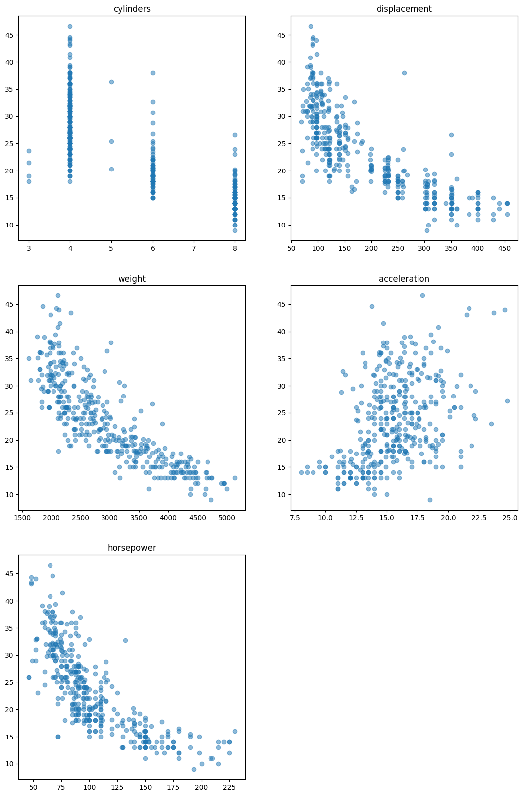
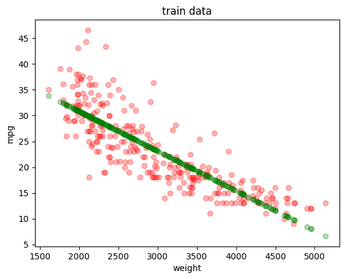
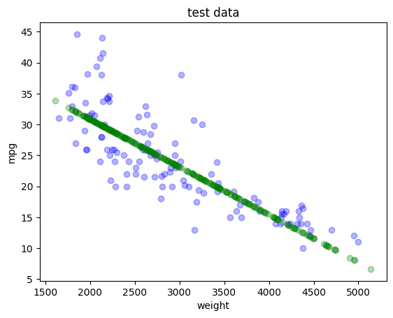
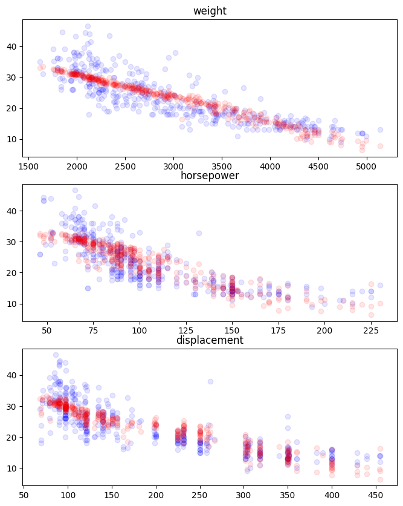

```python
import pandas as pd
import numpy as np
import matplotlib.pyplot as plt
```


```python
path = './data/auto+mpg/auto-mpg.data'
columns = ["mpg", "cylinders", "displacement", "horsepower", "weight", "acceleration", "model year", "origin", "car name"]
# mpg - > 燃油效率
# cylinders -> 气缸
# displacement - > 排量
# horsepower - > 马力
# weight - > 重量
# acceleration - > 加速度
# model year - > 型号年份
# origin = > 编号
# car name - > 原产地
cars = pd.read_csv(path, delim_whitespace=True, names=columns)
cars.head()
```


<div>
<style scoped>
    .dataframe tbody tr th:only-of-type {
        vertical-align: middle;
    }

    .dataframe tbody tr th {
        vertical-align: top;
    }

    .dataframe thead th {
        text-align: right;
    }
</style>
<table border="1" class="dataframe">
  <thead>
    <tr style="text-align: right;">
      <th></th>
      <th>mpg</th>
      <th>cylinders</th>
      <th>displacement</th>
      <th>horsepower</th>
      <th>weight</th>
      <th>acceleration</th>
      <th>model year</th>
      <th>origin</th>
      <th>car name</th>
    </tr>
  </thead>
  <tbody>
    <tr>
      <th>0</th>
      <td>18.0</td>
      <td>8</td>
      <td>307.0</td>
      <td>130.0</td>
      <td>3504.0</td>
      <td>12.0</td>
      <td>70</td>
      <td>1</td>
      <td>chevrolet chevelle malibu</td>
    </tr>
    <tr>
      <th>1</th>
      <td>15.0</td>
      <td>8</td>
      <td>350.0</td>
      <td>165.0</td>
      <td>3693.0</td>
      <td>11.5</td>
      <td>70</td>
      <td>1</td>
      <td>buick skylark 320</td>
    </tr>
    <tr>
      <th>2</th>
      <td>18.0</td>
      <td>8</td>
      <td>318.0</td>
      <td>150.0</td>
      <td>3436.0</td>
      <td>11.0</td>
      <td>70</td>
      <td>1</td>
      <td>plymouth satellite</td>
    </tr>
    <tr>
      <th>3</th>
      <td>16.0</td>
      <td>8</td>
      <td>304.0</td>
      <td>150.0</td>
      <td>3433.0</td>
      <td>12.0</td>
      <td>70</td>
      <td>1</td>
      <td>amc rebel sst</td>
    </tr>
    <tr>
      <th>4</th>
      <td>17.0</td>
      <td>8</td>
      <td>302.0</td>
      <td>140.0</td>
      <td>3449.0</td>
      <td>10.5</td>
      <td>70</td>
      <td>1</td>
      <td>ford torino</td>
    </tr>
  </tbody>
</table>
</div>


```python
cars.info()
```

    <class 'pandas.core.frame.DataFrame'>
    RangeIndex: 398 entries, 0 to 397
    Data columns (total 9 columns):
     #   Column        Non-Null Count  Dtype  
    ---  ------        --------------  -----  
     0   mpg           398 non-null    float64
     1   cylinders     398 non-null    int64  
     2   displacement  398 non-null    float64
     3   horsepower    398 non-null    object 
     4   weight        398 non-null    float64
     5   acceleration  398 non-null    float64
     6   model year    398 non-null    int64  
     7   origin        398 non-null    int64  
     8   car name      398 non-null    object 
    dtypes: float64(4), int64(3), object(2)
    memory usage: 28.1+ KB
    


```python
cars = cars[cars.horsepower != '?']
#用散点图分别展示气缸、排量、重量、加速度与燃油效率的关系
fig = plt.figure(figsize=(13,20))
ax1 = fig.add_subplot(321)
ax2 = fig.add_subplot(322)
ax3 = fig.add_subplot(323)
ax4 = fig.add_subplot(324)
ax5 = fig.add_subplot(325)
ax1.scatter(cars['cylinders'],cars['mpg'],alpha=0.5)
ax1.set_title('cylinders')
ax2.scatter(cars['displacement'],cars['mpg'],alpha=0.5)
ax2.set_title('displacement')
ax3.scatter(cars['weight'],cars['mpg'],alpha=0.5)
ax3.set_title('weight')
ax4.scatter(cars['acceleration'],cars['mpg'],alpha=0.5)
ax4.set_title('acceleration')
ax5.scatter([float(x) for x in cars['horsepower'].tolist()],cars['mpg'],alpha=0.5)
ax5.set_title('horsepower')
```


    Text(0.5, 1.0, 'horsepower')


    

    


```python
Y = cars['mpg']
X = cars[['weight']]
```


```python
from sklearn.model_selection import train_test_split
X_train, X_test, Y_train, Y_test = train_test_split(X,Y,test_size=0.3,random_state=0)
```


```python
from sklearn.linear_model import LinearRegression
lr = LinearRegression()
lr = lr.fit(X_train,Y_train)
```


```python
print(lr.coef_)
print(lr.intercept_)
print('score = {}'.format(lr.score(X,Y)))
```

    [-0.00770724]
    46.254041172147396
    score = 0.6922615526388556
    

# 可视化

## 训练集


```python
plt.scatter(X_train, Y_train, color = 'red', alpha=0.3)
plt.scatter(X_train, lr.predict(X_train),color = 'green',alpha=0.3)
plt.xlabel('weight')
plt.ylabel('mpg')
plt.title('train data')
plt.show()
```


    

    


## 测试集


```python
plt.scatter(X_test,Y_test,color = 'blue',alpha=0.3)
plt.scatter(X_train,lr.predict(X_train),color='green',alpha=0.3)
plt.xlabel('weight')
plt.ylabel('mpg')
plt.title('test data')
plt.show()
```


    

    


## 模型得分


```python
print(lr.coef_)
print(lr.intercept_)
print('score = {}'.format(lr.score(X,Y)))
```

    [-0.00770724]
    46.254041172147396
    score = 0.6922615526388556
    

# 多变量线性回归模型


```python
cars = cars[cars.horsepower != '?']
mul = ['weight','horsepower','displacement'] # 选择三个变量进行建立模型
mul_lr = LinearRegression()
mul_lr.fit(cars[mul],cars['mpg']) # 训练模型
cars['mpg_prediction'] = mul_lr.predict(cars[mul])
cars.head()
```


<div>
<style scoped>
    .dataframe tbody tr th:only-of-type {
        vertical-align: middle;
    }

    .dataframe tbody tr th {
        vertical-align: top;
    }

    .dataframe thead th {
        text-align: right;
    }
</style>
<table border="1" class="dataframe">
  <thead>
    <tr style="text-align: right;">
      <th></th>
      <th>mpg</th>
      <th>cylinders</th>
      <th>displacement</th>
      <th>horsepower</th>
      <th>weight</th>
      <th>acceleration</th>
      <th>model year</th>
      <th>origin</th>
      <th>car name</th>
      <th>mpg_prediction</th>
    </tr>
  </thead>
  <tbody>
    <tr>
      <th>0</th>
      <td>18.0</td>
      <td>8</td>
      <td>307.0</td>
      <td>130.0</td>
      <td>3504.0</td>
      <td>12.0</td>
      <td>70</td>
      <td>1</td>
      <td>chevrolet chevelle malibu</td>
      <td>18.915289</td>
    </tr>
    <tr>
      <th>1</th>
      <td>15.0</td>
      <td>8</td>
      <td>350.0</td>
      <td>165.0</td>
      <td>3693.0</td>
      <td>11.5</td>
      <td>70</td>
      <td>1</td>
      <td>buick skylark 320</td>
      <td>16.197184</td>
    </tr>
    <tr>
      <th>2</th>
      <td>18.0</td>
      <td>8</td>
      <td>318.0</td>
      <td>150.0</td>
      <td>3436.0</td>
      <td>11.0</td>
      <td>70</td>
      <td>1</td>
      <td>plymouth satellite</td>
      <td>18.382258</td>
    </tr>
    <tr>
      <th>3</th>
      <td>16.0</td>
      <td>8</td>
      <td>304.0</td>
      <td>150.0</td>
      <td>3433.0</td>
      <td>12.0</td>
      <td>70</td>
      <td>1</td>
      <td>amc rebel sst</td>
      <td>18.479076</td>
    </tr>
    <tr>
      <th>4</th>
      <td>17.0</td>
      <td>8</td>
      <td>302.0</td>
      <td>140.0</td>
      <td>3449.0</td>
      <td>10.5</td>
      <td>70</td>
      <td>1</td>
      <td>ford torino</td>
      <td>18.821729</td>
    </tr>
  </tbody>
</table>
</div>


```python
mul_score = mul_lr.score(cars[mul],cars['mpg'])
mul_score
```


    0.7069554693444708


```python
from sklearn.metrics import mean_squared_error as mse
mse = mse(cars['mpg'],cars['mpg_prediction'])
print('mse = %f'%mse)
print('rmse = %f'%np.sqrt(mse))
```

    mse = 17.806188
    rmse = 4.219738
    


```python
fig = plt.figure(figsize = (8,10))
ax1 = fig.add_subplot(3,1,1)
ax2 = fig.add_subplot(3,1,2)
ax3 = fig.add_subplot(3,1,3)
ax1.scatter(cars['weight'], cars['mpg'], c='blue', alpha=0.1)
ax1.scatter(cars['weight'], cars['mpg_prediction'], c='red', alpha=0.1)
ax1.set_title('weight')
ax2.scatter([ float(x) for x in cars['horsepower'].tolist()], cars['mpg'], c='blue', alpha=0.1)
ax2.scatter([ float(x) for x in cars['horsepower'].tolist()], cars['mpg_prediction'], c='red', alpha=0.1)
ax2.set_title('horsepower')
ax3.scatter(cars['displacement'], cars['mpg'], c='blue', alpha=0.1)
ax3.scatter(cars['displacement'], cars['mpg_prediction'], c='red', alpha=0.1)
ax3.set_title('displacement')
plt.show()
```


    

    

