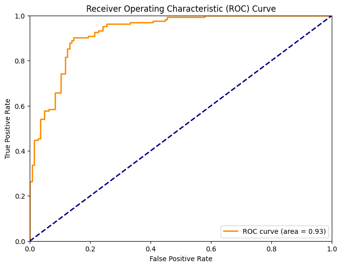

```python
# 导入必要的库
import pandas as pd
import numpy as np
import matplotlib.pyplot as plt
from sklearn.model_selection import train_test_split
from sklearn.preprocessing import StandardScaler
from sklearn.svm import SVC
from sklearn.metrics import roc_curve , auc ,accuracy_score, classification_report
```


```python
# 加载Heart Disease数据集
# columns = ['age', 'sex', 'cp', 'trestbps', 'chol', 'fbs', 'restecg', 'thalach', 'exang', 'oldpeak', 'slope', 'ca', 'thal', 'target']
path = './data/heart.csv'
data = pd.read_csv(path)
print(f"data.shape: {data.shape}")
# data.head()

```

    data.shape: (1025, 14)
    


```python
# 数据预处理
data = data.replace('?', np.nan) # 将缺失值替换为 np.nan
data = data.dropna() # 删除含有缺失值的行
print(f"data.shape: {data.shape}")
data.head()
```

    data.shape: (1025, 14)
    


<div>
<style scoped>
    .dataframe tbody tr th:only-of-type {
        vertical-align: middle;
    }

    .dataframe tbody tr th {
        vertical-align: top;
    }

    .dataframe thead th {
        text-align: right;
    }
</style>
<table border="1" class="dataframe">
  <thead>
    <tr style="text-align: right;">
      <th></th>
      <th>age</th>
      <th>sex</th>
      <th>cp</th>
      <th>trestbps</th>
      <th>chol</th>
      <th>fbs</th>
      <th>restecg</th>
      <th>thalach</th>
      <th>exang</th>
      <th>oldpeak</th>
      <th>slope</th>
      <th>ca</th>
      <th>thal</th>
      <th>target</th>
    </tr>
  </thead>
  <tbody>
    <tr>
      <th>0</th>
      <td>52</td>
      <td>1</td>
      <td>0</td>
      <td>125</td>
      <td>212</td>
      <td>0</td>
      <td>1</td>
      <td>168</td>
      <td>0</td>
      <td>1.0</td>
      <td>2</td>
      <td>2</td>
      <td>3</td>
      <td>0</td>
    </tr>
    <tr>
      <th>1</th>
      <td>53</td>
      <td>1</td>
      <td>0</td>
      <td>140</td>
      <td>203</td>
      <td>1</td>
      <td>0</td>
      <td>155</td>
      <td>1</td>
      <td>3.1</td>
      <td>0</td>
      <td>0</td>
      <td>3</td>
      <td>0</td>
    </tr>
    <tr>
      <th>2</th>
      <td>70</td>
      <td>1</td>
      <td>0</td>
      <td>145</td>
      <td>174</td>
      <td>0</td>
      <td>1</td>
      <td>125</td>
      <td>1</td>
      <td>2.6</td>
      <td>0</td>
      <td>0</td>
      <td>3</td>
      <td>0</td>
    </tr>
    <tr>
      <th>3</th>
      <td>61</td>
      <td>1</td>
      <td>0</td>
      <td>148</td>
      <td>203</td>
      <td>0</td>
      <td>1</td>
      <td>161</td>
      <td>0</td>
      <td>0.0</td>
      <td>2</td>
      <td>1</td>
      <td>3</td>
      <td>0</td>
    </tr>
    <tr>
      <th>4</th>
      <td>62</td>
      <td>0</td>
      <td>0</td>
      <td>138</td>
      <td>294</td>
      <td>1</td>
      <td>1</td>
      <td>106</td>
      <td>0</td>
      <td>1.9</td>
      <td>1</td>
      <td>3</td>
      <td>2</td>
      <td>0</td>
    </tr>
  </tbody>
</table>
</div>


```python
# 数据划分
X = data.drop('target', axis=1) # 特征矩阵
y = data['target']              # 标签向量
print(f"X.shape: {X.shape}")
print(f"y.shape: {y.shape}")

# 拆分数据集为训练集和测试集
X_train, X_test, y_train, y_test = train_test_split(X, y, test_size=0.3, random_state=0) 

# 特征标准化
scaler = StandardScaler()
X_train = scaler.fit_transform(X_train)
X_test = scaler.transform(X_test)
```

    X.shape: (1025, 13)
    y.shape: (1025,)
    


```python
# 模型构建
svm = SVC(kernel='linear', C=1.0, random_state=42, probability=True) # 创建 SVM 分类器，设置 probability 参数为 True，以便输出预测概率
# 使用训练集拟合模型
svm = svm.fit(X_train, y_train) 

# 预测概率
y_scores = svm.decision_function(X_test)
print(f"y_scores.shape: {y_scores.shape}")

# 预测测试集
y_pred = svm.predict(X_test)
print(f"y_pred.shape: {y_pred.shape}")
# print(f"y_pred: {y_pred}")
```

    y_scores.shape: (308,)
    y_pred.shape: (308,)
    


```python
# 计算准确度
accuracy = accuracy_score(y_test, y_pred)

# 打印准确度
print(f"Accuracy_score: {accuracy}")

# classification_report
report_dict = classification_report(y_test, y_pred, output_dict=False)
print(f"classification_report:\n {report_dict}")
```

    Accuracy_score: 0.8571428571428571
    classification_report:
                   precision    recall  f1-score   support
    
               0       0.91      0.77      0.84       145
               1       0.82      0.93      0.87       163
    
        accuracy                           0.86       308
       macro avg       0.87      0.85      0.85       308
    weighted avg       0.86      0.86      0.86       308
    
    


```python
# 计算ROC曲线的参数
fpr, tpr, thresholds = roc_curve(y_test, y_scores)

# 计算曲线下面积（AUC）
roc_auc = auc(fpr, tpr)

# 绘制ROC曲线
plt.figure(figsize=(8, 6))
plt.plot(fpr, tpr, color='darkorange', lw=2, label='ROC curve (area = {:.2f})'.format(roc_auc))
plt.plot([0, 1], [0, 1], color='navy', lw=2, linestyle='--')
plt.xlim([0.0, 1.0])
plt.ylim([0.0, 1.0])
plt.xlabel('False Positive Rate')
plt.ylabel('True Positive Rate')
plt.title('Receiver Operating Characteristic (ROC) Curve')
plt.legend(loc='lower right')
plt.show()

```


    

    

