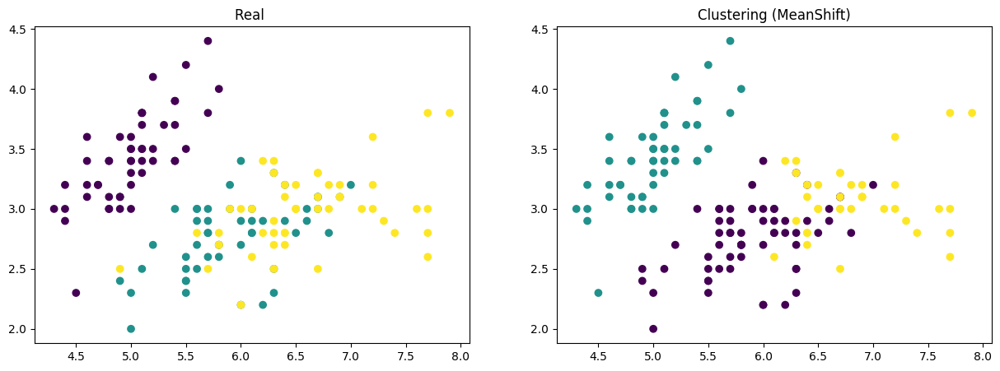
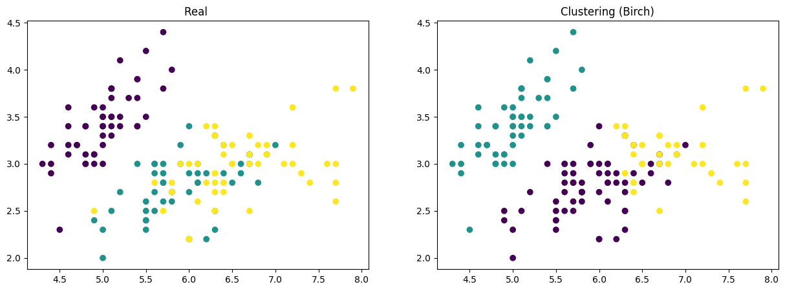

# 引入数据


```python
from sklearn.datasets import load_iris
from sklearn.cluster import KMeans, MeanShift, Birch, DBSCAN
from IPython.display import display
import matplotlib.pyplot as plt
import pandas as pd
import numpy as np
# 评价方法
from sklearn.metrics import adjusted_rand_score         # 聚类模型评估工具
from sklearn.metrics import silhouette_score            # 轮廓系数（Silhouette Coefficient）
from sklearn.metrics import calinski_harabasz_score     # Calinski-Harabasz指数
from sklearn.metrics import v_measure_score             # V-分数（V-Measure）

# 加载鸢尾花数（Iris）据集
iris = load_iris() 
data = iris.data[:,:] # 取四列（花萼长、宽；花瓣长、宽）作为特征数据
target = iris.target # 标签数据
feature_names = iris.feature_names[:] # 列的名字
df = pd.DataFrame(data, columns=feature_names)# 创建数据框
display(df) # 显示数据集
```


<div>
<style scoped>
    .dataframe tbody tr th:only-of-type {
        vertical-align: middle;
    }

    .dataframe tbody tr th {
        vertical-align: top;
    }

    .dataframe thead th {
        text-align: right;
    }
</style>
<table border="1" class="dataframe">
  <thead>
    <tr style="text-align: right;">
      <th></th>
      <th>sepal length (cm)</th>
      <th>sepal width (cm)</th>
      <th>petal length (cm)</th>
      <th>petal width (cm)</th>
    </tr>
  </thead>
  <tbody>
    <tr>
      <th>0</th>
      <td>5.1</td>
      <td>3.5</td>
      <td>1.4</td>
      <td>0.2</td>
    </tr>
    <tr>
      <th>1</th>
      <td>4.9</td>
      <td>3.0</td>
      <td>1.4</td>
      <td>0.2</td>
    </tr>
    <tr>
      <th>2</th>
      <td>4.7</td>
      <td>3.2</td>
      <td>1.3</td>
      <td>0.2</td>
    </tr>
    <tr>
      <th>3</th>
      <td>4.6</td>
      <td>3.1</td>
      <td>1.5</td>
      <td>0.2</td>
    </tr>
    <tr>
      <th>4</th>
      <td>5.0</td>
      <td>3.6</td>
      <td>1.4</td>
      <td>0.2</td>
    </tr>
    <tr>
      <th>...</th>
      <td>...</td>
      <td>...</td>
      <td>...</td>
      <td>...</td>
    </tr>
    <tr>
      <th>145</th>
      <td>6.7</td>
      <td>3.0</td>
      <td>5.2</td>
      <td>2.3</td>
    </tr>
    <tr>
      <th>146</th>
      <td>6.3</td>
      <td>2.5</td>
      <td>5.0</td>
      <td>1.9</td>
    </tr>
    <tr>
      <th>147</th>
      <td>6.5</td>
      <td>3.0</td>
      <td>5.2</td>
      <td>2.0</td>
    </tr>
    <tr>
      <th>148</th>
      <td>6.2</td>
      <td>3.4</td>
      <td>5.4</td>
      <td>2.3</td>
    </tr>
    <tr>
      <th>149</th>
      <td>5.9</td>
      <td>3.0</td>
      <td>5.1</td>
      <td>1.8</td>
    </tr>
  </tbody>
</table>
<p>150 rows × 4 columns</p>
</div>


# 训练

## K-均值聚类（KMeans）


```python
# 注意：聚类模型的评估使用sklearn.metrics.adjusted_rand_score函数
# 参数1-实际类别标签
# 参数2-聚类结果标签
# 调用聚类算法

model = KMeans(3, n_init=10).fit(data) # K-均值聚类

# model = MeanShift().fit(data) # 均值漂移聚类
# model = Birch().fit(data) # Birch聚类
c_target = model.labels_ # 聚类结果标签

# 计算实际聚类数量
print("实际聚类数量:", len(np.unique(c_target)))

# 使用adjusted_rand_score函数来评估聚类效果
# 参数1-实际类别标签
# 参数2-聚类结果标签
print('adjusted_rand_score:     ', adjusted_rand_score(target, c_target))

# 计算轮廓系数
silhouette_avg = silhouette_score(data, c_target)
print("整体轮廓系数:             ", silhouette_avg)

# 计算Calinski-Harabasz指数
calinski_harabasz_index = calinski_harabasz_score(data, c_target)
print("Calinski-Harabasz指数:   ", calinski_harabasz_index)

# 计算V-Measure
v_measure = v_measure_score(target, c_target)
print("V-分数(V-Measure):       ", v_measure)
```

    实际聚类数量: 3
    adjusted_rand_score:      0.7302382722834697
    整体轮廓系数:              0.5528190123564095
    Calinski-Harabasz指数:    561.62775662962
    V-分数(V-Measure):        0.7581756800057784
    


```python
# 定义画板尺寸
fig = plt.figure(figsize=(15, 5))

# 画第一幅子图——实际类别标签
ax1 = fig.add_subplot(1, 2, 1)
ax1.set_title('Real ')
ax1.scatter(data[:,0], data[:,1], c=target)

# 画第二幅子图——聚类结果
ax2 = fig.add_subplot(1, 2, 2)
ax2.set_title('Clustering (KMeans)')
ax2.scatter(data[:,0], data[:,1], c=c_target)

# 显示图形
plt.show()
```


    

    


## 均值漂移聚类（MeanShift）


```python
# 注意：聚类模型的评估使用sklearn.metrics.adjusted_rand_score函数
# 参数1-实际类别标签
# 参数2-聚类结果标签
# 调用聚类算法

# model = KMeans(3).fit(data) # K-均值聚类

model = MeanShift(bandwidth=0.85).fit(data) # 均值漂移聚类
# model = Birch().fit(data) # Birch聚类
c_target = model.labels_ # 聚类结果标签

# 计算实际聚类数量
print("实际聚类数量:", len(np.unique(c_target)))

# 使用adjusted_rand_score函数来评估聚类效果
# 参数1-实际类别标签
# 参数2-聚类结果标签
print('adjusted_rand_score:     ', adjusted_rand_score(target, c_target))

# 计算轮廓系数
silhouette_avg = silhouette_score(data, c_target)
print("整体轮廓系数:             ", silhouette_avg)

# 计算Calinski-Harabasz指数
calinski_harabasz_index = calinski_harabasz_score(data, c_target)
print("Calinski-Harabasz指数:   ", calinski_harabasz_index)

# 计算V-Measure
v_measure = v_measure_score(target, c_target)
print("V-分数(V-Measure):       ", v_measure)
```

    实际聚类数量: 3
    adjusted_rand_score:      0.7436826319432358
    整体轮廓系数:              0.5511573791952857
    Calinski-Harabasz指数:    560.1394503001885
    V-分数(V-Measure):        0.7660355440487252
    


```python
# 定义画板尺寸
fig = plt.figure(figsize=(15, 5))

# 画第一幅子图——实际类别标签
ax1 = fig.add_subplot(1, 2, 1)
ax1.set_title('Real ')
ax1.scatter(data[:,0], data[:,1], c=target)

# 画第二幅子图——聚类结果
ax2 = fig.add_subplot(1, 2, 2)
ax2.set_title('Clustering (MeanShift)')
ax2.scatter(data[:,0], data[:,1], c=c_target)

# 显示图形
plt.show()
```


    

    


## Birch聚类（Birch）


```python
# 注意：聚类模型的评估使用sklearn.metrics.adjusted_rand_score函数
# 参数1-实际类别标签
# 参数2-聚类结果标签
# 调用聚类算法

# model = KMeans(3).fit(data) # K-均值聚类

# model = MeanShift().fit(data) # 均值漂移聚类
model = Birch(threshold=0.4, branching_factor=50).fit(data) # Birch聚类
c_target = model.labels_ # 聚类结果标签

# 计算实际聚类数量
print("实际聚类数量:", len(np.unique(c_target)))

# 使用adjusted_rand_score函数来评估聚类效果
# 参数1-实际类别标签
# 参数2-聚类结果标签
print('adjusted_rand_score:     ', adjusted_rand_score(target, c_target))

# 计算轮廓系数
silhouette_avg = silhouette_score(data, c_target)
print("整体轮廓系数:             ", silhouette_avg)

# 计算Calinski-Harabasz指数
calinski_harabasz_index = calinski_harabasz_score(data, c_target)
print("Calinski-Harabasz指数:   ", calinski_harabasz_index)

# 计算V-Measure
v_measure = v_measure_score(target, c_target)
print("V-分数(V-Measure):       ", v_measure)
```

    实际聚类数量: 3
    adjusted_rand_score:      0.7455038681804481
    整体轮廓系数:              0.5553062646081594
    Calinski-Harabasz指数:    556.1176919037501
    V-分数(V-Measure):        0.7979885217013319
    


```python
# 定义画板尺寸
fig = plt.figure(figsize=(15, 5))

# 画第一幅子图——实际类别标签
ax1 = fig.add_subplot(1, 2, 1)
ax1.set_title('Real ')
ax1.scatter(data[:,0], data[:,1], c=target)

# 画第二幅子图——聚类结果
ax2 = fig.add_subplot(1, 2, 2)
ax2.set_title('Clustering (Birch)')
ax2.scatter(data[:,0], data[:,1], c=c_target)

# 显示图形
plt.show()
```


    

    

